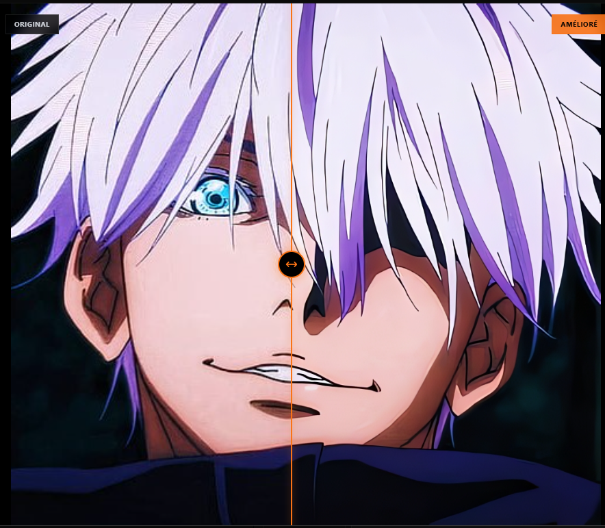

<p align="center">
  
</p>

<h1 align="center">FoxShoot</h1>

<p align="center">
  <b>Professional AI-Powered Image & Video Upscaler</b>
  <br>
  <sub>Transform low-resolution media into stunning high-definition content</sub>
</p>

<p align="center">
  
  
  
  
</p>

<p align="center">
  <a href="#-features">Features</a> •
  <a href="#-showcase">Showcase</a> •
  <a href="#-installation">Installation</a> •
  <a href="#-usage">Usage</a> •
  <a href="#-requirements">Requirements</a> •
  <a href="#-faq">FAQ</a>
</p>

---

<p align="center">
  
</p>

---

## 🎯 What is FoxShoot?

**FoxShoot** is a professional-grade desktop application that leverages cutting-edge neural network technology to upscale and enhance your images and videos.

Our proprietary processing engine is built on an optimized version of industry-leading upscaling algorithms, specifically engineered for:

| Feature                         | Benefit                                        |
| ------------------------------- | ---------------------------------------------- |
| ⚡ **Maximum Performance**      | Processes 4K frames in seconds, not minutes    |
| 🎮 **Universal GPU Support**    | Works on NVIDIA, AMD, and Intel via Vulkan     |
| 💻 **Low Resource Usage**       | Runs smoothly on systems with just 4GB RAM     |
| 🎨 **Content-Aware Processing** | Separate optimization paths for anime & photos |

---

## ✨ Features

### 🖼️ Image Processing

- **Formats**: PNG, JPG, JPEG, WebP, BMP
- **Scale Factors**: 2x, 3x, 4x upscaling
- **Batch Processing**: Handle hundreds of images at once
- **Quality Preservation**: Maintains sharpness without artifacts

### 🎬 Video Processing

- **Formats**: MP4, MKV, AVI, WebM, MOV
- **Audio Handling**: Preserve or remove audio tracks
- **Quality Presets**: Low (fast), Medium (balanced), High (pristine)
- **Encoding Options**: H.264, VP9 with customizable CRF

### 🎨 User Experience

| Feature                  | Description                               |
| ------------------------ | ----------------------------------------- |
| 🌙 **Dark Mode UI**      | Premium dark interface, easy on the eyes  |
| 🌍 **Multilingual**      | English & French with more coming         |
| 📁 **Drag & Drop**       | Simply drop files to begin                |
| 📊 **Live Progress**     | Real-time percentage, ETA, and status     |
| 🔍 **Comparison Slider** | Before/after view with interactive slider |
| 💾 **Queue Persistence** | Resume work after app restart             |

### 🖥️ Windows Integration

- **Context Menu**: Right-click "🦊 Enhance with FoxShoot" on any file
- **System Tray**: Minimize to tray, always accessible
- **File Associations**: Optional default handler for media files

---

## 📸 Showcase

### Main Interface

<p align="center">
  
</p>

### Before & After Comparison

<p align="center">
  
</p>

### Batch Processing

<p align="center">
  
</p>

### Video Upscaling

<p align="center">
  
</p>

### Quality Comparison

<table>
  <tr>
    <td align="center"><b>Original (480p)</b></td>
    <td align="center"><b>FoxShoot 4x (1920p)</b></td>
  </tr>
  <tr>
    <td></td>
    <td></td>
  </tr>
</table>

---

## 📥 Installation

### Download

| Version | Platform               | Download                                                                         |
| ------- | ---------------------- | -------------------------------------------------------------------------------- |
| v3.0.0  | Windows 10/11 (64-bit) | [**Download Installer**](https://github.com/Tiger-Foxx/FoxShoot/releases/latest) |

### Install Steps

1. Download `FoxShoot_Setup_3.0.0.exe`
2. Run the installer (admin rights required)
3. Choose installation options:
   - ☑️ Desktop shortcut
   - ☑️ Add to right-click menu
4. Launch FoxShoot and start enhancing!

---

## 🚀 Usage

### Quick Start

```
1. Launch FoxShoot
2. Drag & drop your files (or use File → Open)
3. Select scale factor (2x, 3x, or 4x)
4. Adjust quality settings if needed
5. Click "Start" and watch the magic happen ✨
```

### Keyboard Shortcuts

| Shortcut | Action                   |
| -------- | ------------------------ |
| `Ctrl+O` | Open file dialog         |
| `Ctrl+S` | Open settings            |
| `Space`  | Start/Pause processing   |
| `Esc`    | Cancel current operation |

### Right-Click Enhancement

After installation, simply right-click any image or video in Windows Explorer and select **"🦊 Enhance with FoxShoot"** — the app will launch and begin processing automatically!

---

## 💻 System Requirements

### Minimum

| Component | Requirement                           |
| --------- | ------------------------------------- |
| OS        | Windows 10 (64-bit)                   |
| RAM       | 4 GB                                  |
| GPU       | Any with Vulkan support (or CPU-only) |
| Storage   | 500 MB free space                     |

### Recommended

| Component | Recommendation                                |
| --------- | --------------------------------------------- |
| OS        | Windows 10/11 (64-bit)                        |
| RAM       | 8 GB or more                                  |
| GPU       | NVIDIA GTX 1060 / AMD RX 580 / Intel UHD 630+ |
| Storage   | SSD for faster I/O                            |

### GPU Compatibility

| Vendor | Supported Series             |
| ------ | ---------------------------- |
| NVIDIA | GTX 900+, RTX series, Quadro |
| AMD    | RX 400+, Vega, RDNA series   |
| Intel  | UHD 600+, Iris, Arc series   |

---

## ❓ FAQ

<details>
<summary><b>How long does processing take?</b></summary>
<br>
Processing time depends on resolution, scale factor, and GPU. Typical times:

| Content          | 2x Upscale | 4x Upscale  |
| ---------------- | ---------- | ----------- |
| 1080p Image      | ~1 second  | ~3 seconds  |
| 5-min 720p Video | ~3 minutes | ~10 minutes |

GPU acceleration provides 5-10x speedup vs CPU-only.

</details>

<details>
<summary><b>Can I use FoxShoot without a GPU?</b></summary>
<br>
Yes! FoxShoot automatically falls back to CPU processing if no compatible GPU is found. However, GPU acceleration is highly recommended for video processing.
</details>

<details>
<summary><b>What's the maximum resolution supported?</b></summary>
<br>
FoxShoot can process inputs up to 8K resolution. Output is limited only by available VRAM/RAM. For very large images, the tile-based processing system prevents memory issues.
</details>

<details>
<summary><b>Is my data sent to the cloud?</b></summary>
<br>
No. FoxShoot processes everything locally on your machine. No internet connection required, no data leaves your computer.
</details>

<details>
<summary><b>Can I use FoxShoot commercially?</b></summary>
<br>
Yes! FoxShoot is licensed under MIT. You can use it for personal and commercial projects.
</details>

---

## 🛠️ Technology

| Layer        | Technology                  |
| ------------ | --------------------------- |
| Frontend     | React 18, Vite, TailwindCSS |
| Desktop      | Tauri 2.0 (Rust)            |
| Processing   | Proprietary Neural Engine   |
| Video        | FFmpeg 6.x                  |
| Acceleration | Vulkan API                  |

---

## 🗺️ Roadmap

- [x] v3.0 - Production release
- [ ] v3.1 - macOS support
- [ ] v3.2 - Linux support
- [ ] v4.0 - Real-time preview
- [ ] v4.1 - Custom model support

---

## 📄 License

This project is licensed under the **MIT License** - see the [LICENSE](LICENSE) file for details.

```
MIT License

Copyright (c) 2024-2026 Fox (Tiger-Foxx)

Permission is hereby granted, free of charge, to any person obtaining a copy
of this software...
```

---

## 👤 Author

<p align="center">
  
  <br>
  <b>Fox (Tiger-Foxx)</b>
  <br>
  <a href="https://github.com/Tiger-Foxx">GitHub</a> •
  <a href="https://twitter.com/TigerFoxx">Twitter</a>
</p>

---

## 🙏 Acknowledgments

- The incredible **FFmpeg** team
- **Tauri** for the amazing desktop framework
- The open-source community for endless inspiration

---

<p align="center">
  
  <br>
  <b>Made with ❤️ by Fox</b>
  <br>
  <sub>© 2024-2026 Tiger-Foxx. All rights reserved.</sub>
</p>
